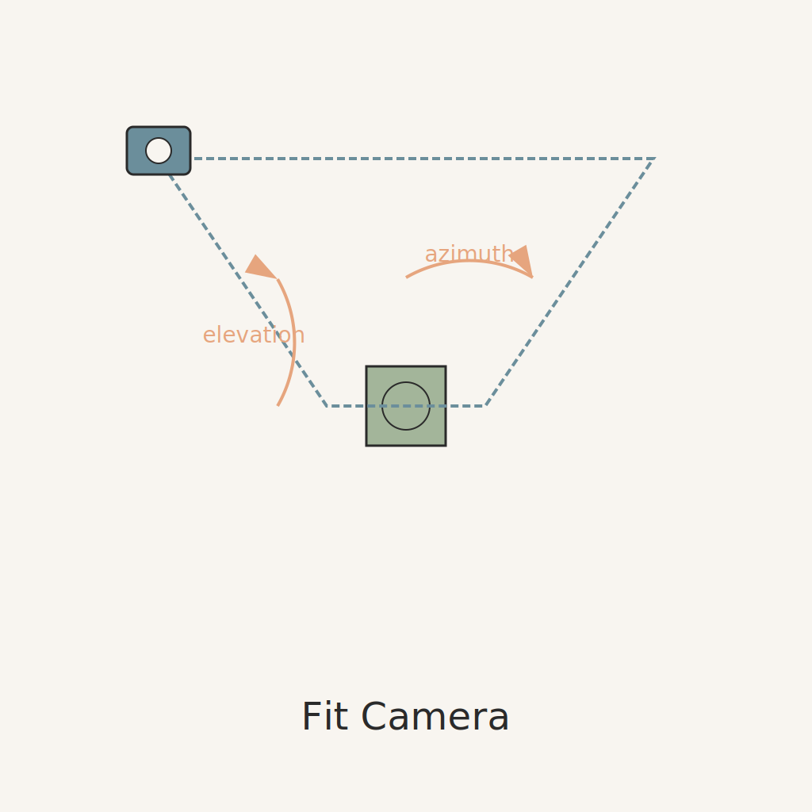
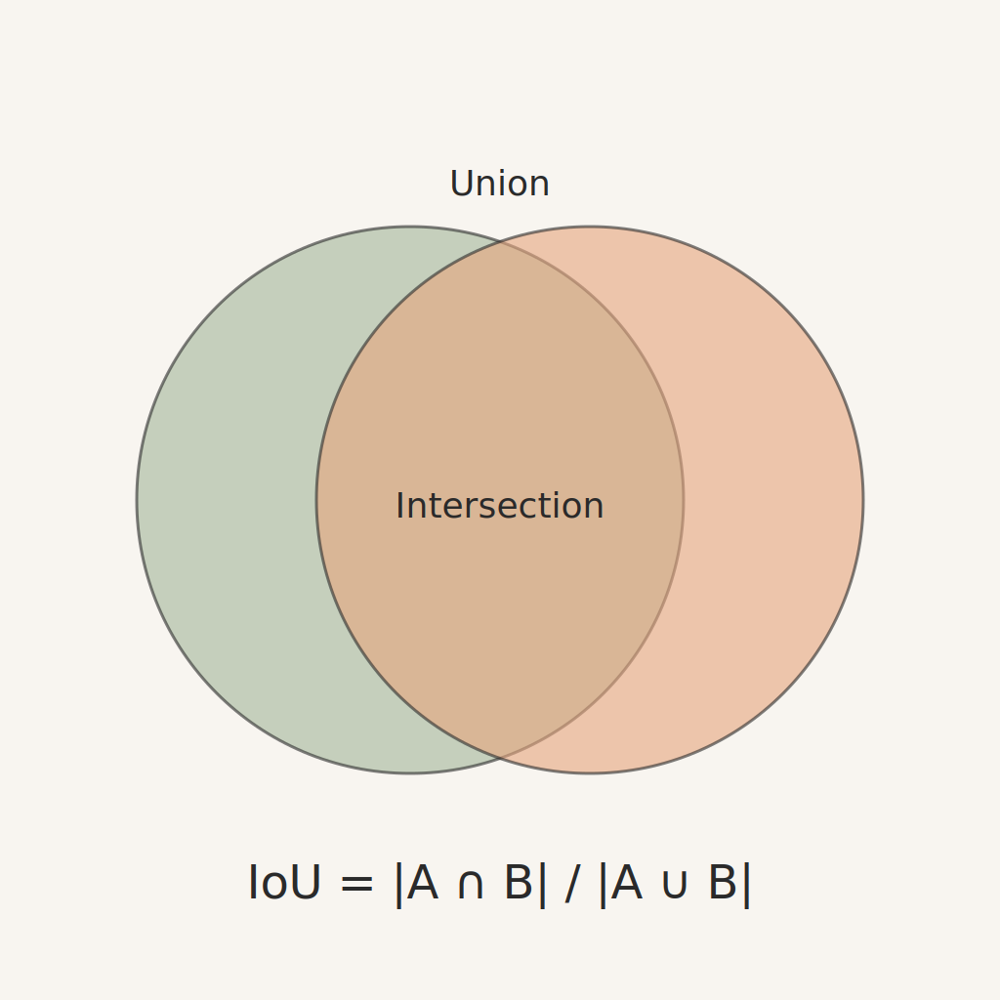
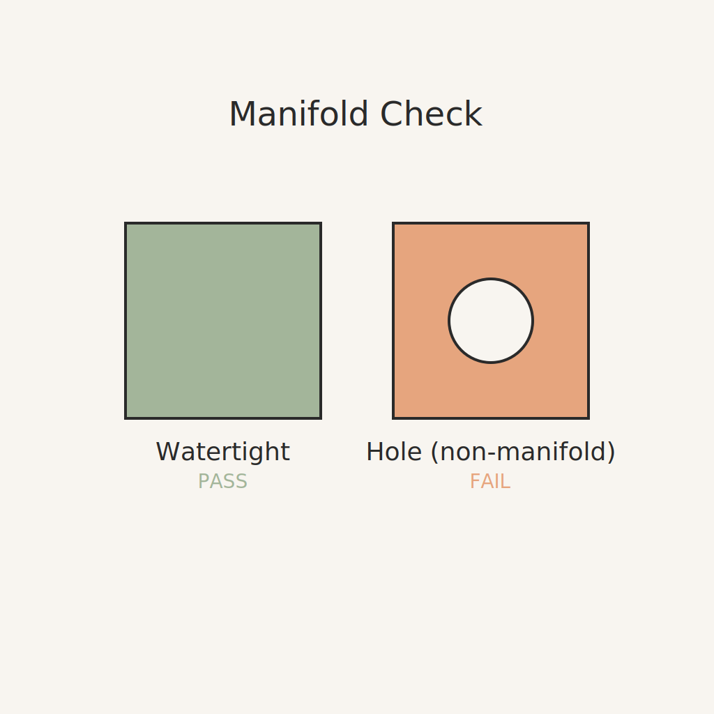
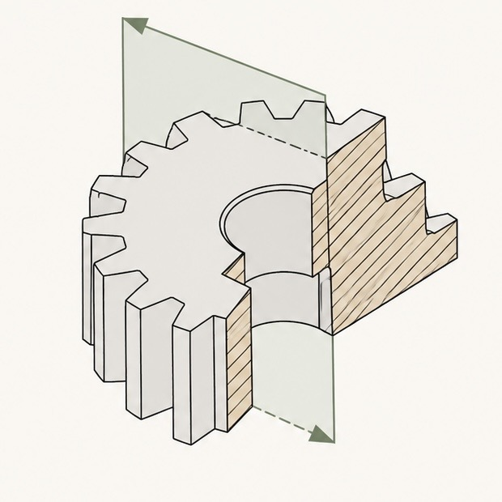

# Glossary

One-line definitions + a good link for every domain term used across `3d`. Reference it from
anywhere: `[SAM2](GLOSSARY.md#sam2)`. Keep it growing as new terms appear; explain each term at its
first mention in the README, then link here.

### 3MF

Modern print format that natively carries color, materials, and metadata (preferred rich mesh format). https://3mf.io/

### AE
Absolute Error; ImageMagick metric counting mismatched pixels (normalized = count/area). 0 = perfect match. https://imagemagick.org/script/compare.php

### B-rep
Boundary Representation; solid modeled by its bounding faces/edges/vertices (OCCT/CadQuery/build123d), as opposed to CSG. https://en.wikipedia.org/wiki/Boundary_representation

### Blender / bpy

Open-source 3D suite; `bpy` is its Python API, used here for photoreal (Cycles/EEVEE) rendering. https://docs.blender.org/api/current/

### BOSL2

"Belfry OpenSCAD Library v2", a large helper library (shapes, threads, transforms) for OpenSCAD. https://github.com/BelfrySCAD/BOSL2

### CGAL

Computational Geometry Algorithms Library; OpenSCAD's exact-geometry backend for `--render`/F6 (real booleans, manifold solids) vs the fast preview (F5). https://www.cgal.org/

### Chamfer

Beveled edge connecting two surfaces; also the mean nearest-neighbor distance metric between two point sets/meshes (lower = closer). https://en.wikipedia.org/wiki/Chamfer_(geometry)

### CLIP-similarity

Cosine similarity of CLIP image/text embeddings; semantic match score. https://github.com/openai/CLIP

### COLMAP

Structure-from-motion / multi-view stereo. https://colmap.github.io/

### CSG

Constructive Solid Geometry; building shapes via union/difference/intersection. https://en.wikipedia.org/wiki/Constructive_solid_geometry

### Depth-Anything (V2)

Monocular depth estimation foundation model. https://github.com/DepthAnything/Depth-Anything-V2

### Depth-Anything V2
Monocular depth estimation foundation model (V2). https://github.com/DepthAnything/Depth-Anything-V2

### Differentiable rendering
Rendering whose image-to-parameter gradients exist, so an image loss can be backpropagated into scene geometry. https://en.wikipedia.org/wiki/Differentiable_rendering

### DSSIM
Structural dissimilarity index; distance variant of SSIM where 0 = identical. https://en.wikipedia.org/wiki/Structural_similarity_index_measure

### FDM

Fused Deposition Modeling; layer-by-layer filament 3D printing. https://en.wikipedia.org/wiki/Fused_filament_fabrication

### FDM anisotropy

Printed parts are weaker across layer lines than in-plane; strength must apply a knockdown factor by print orientation (PETG ~0.7×, PLA ~0.45× cross-layer). https://doi.org/10.1108/13552540210441166 (Ahn et al. 2002)

### FDM strength
The mechanical strength of an FDM print, dominated by layer-adhesion anisotropy. https://doi.org/10.1108/13552540210441166 (Ahn et al. 2002)

### F-score@τ

Harmonic mean of precision/recall of points within threshold τ; standard 3D-reconstruction accuracy metric (Tatarchenko et al. 2019). https://arxiv.org/abs/1905.03678

### ffmpeg

Media transcoder with a DAG filter-graph; inspiration for the op-DAG + the power-without-bad-UX layering. https://ffmpeg.org/

### fit-camera

Silhouette-IoU camera-pose fitting: search azimuth/elevation/distance/pan until a render's silhouette best matches a reference photo, then freeze.

https://en.wikipedia.org/wiki/Camera_pose_estimation

### FlipFlop effect
LLMs flip answers ~46% and lose ~17% accuracy when challenged; the reason a critique loop must be judged by an external numeric metric. https://arxiv.org/abs/2311.08596

### Forced-monotonic loop

An LLM edit loop that ACCEPTS a parameter change only if the score strictly improves (and gates pass), logging every attempt so a failed move is never retried; turns "an LLM fiddling with numbers" into reproducible convergence. https://arxiv.org/abs/2510.11498

### Hausdorff

Worst-case (max) surface deviation between two shapes. https://en.wikipedia.org/wiki/Hausdorff_distance

### Hausdorff distance

Worst-case (max) surface deviation between two shapes. https://en.wikipedia.org/wiki/Hausdorff_distance

### HyperFrames

HeyGen tool where agents compose video via HTML/CSS/JS; used to build the §14 showcase demo. https://hyperframes.heygen.com/

### Hunyuan3D

Tencent image-to-3D generation. https://github.com/Tencent/Hunyuan3D-2

### InstantMesh

Feed-forward sparse-view → mesh. https://github.com/TencentARC/InstantMesh

### Inverse procedural modeling (IPM)
Recovering a procedural generator's parameters so its output matches a target; the formal name for the match loop. https://www.mdpi.com/2073-8994/16/2/184

### IoU

Intersection-over-Union; overlap of two regions (silhouettes) or volumes. 1.0 = identical.

https://en.wikipedia.org/wiki/Jaccard_index

### jq

Command-line JSON processor; the inspiration for `3d om` (pipeable filters over the object model). https://jqlang.github.io/jq/

### LPIPS

Learned Perceptual Image Patch Similarity; perceptual image distance (Zhang et al. 2018). https://arxiv.org/abs/1801.03924

### LRM

Large Reconstruction Model; feed-forward single-image → triplane NeRF. https://yiconghong.me/LRM/

### Manifold

A watertight, closed solid (every edge shared by exactly two faces); required for valid boolean ops and printing.

https://en.wikipedia.org/wiki/Manifold

### manifold3d

Robust mesh boolean/manifoldness library. https://github.com/elalish/manifold

### Marching cubes
Algorithm that meshes the zero-isosurface of an SDF/scalar field; how implicit AI outputs become triangle meshes. https://en.wikipedia.org/wiki/Marching_cubes

### Marigold

Diffusion-based monocular depth/normal estimation. https://github.com/prs-eth/Marigold

### Materials registry
Canonical `materials.yaml` storing per-material properties (density, anisotropy, color) used across the pipeline. https://pmc.ncbi.nlm.nih.gov/articles/PMC9230522/

### Mitsuba 3

Differentiable/physically-based renderer. https://www.mitsuba-renderer.org/

### NopSCADlib

OpenSCAD library of mechanical parts (vitamins), assemblies, BOM. https://github.com/nophead/NopSCADlib

### Normal consistency

Agreement of surface normals between meshes; complements point-distance metrics. https://en.wikipedia.org/wiki/Surface_normal

### nvdiffrast

Differentiable rasterizer (NVIDIA) for inverse rendering. https://github.com/NVlabs/nvdiffrast

### Object model

The semantic layer over geometry (a DOM-like tree with id/class selectors + a CSS-like stylesheet of rules); see architecture spec §4 and ROADMAP §5. https://en.wikipedia.org/wiki/Object_model

### ollama

Run LLMs locally; optional local-AI backend for `3d ai`. https://ollama.com/

### OpenCV

Computer-vision library (contours, PCA, moments) used for axis/silhouette analysis. https://opencv.org/

### OpenSCAD

Script-based parametric solid CAD; the primary modeling language `3d` drives. https://openscad.org/

### Operation DAG

The pipeline modeled as a directed acyclic graph of operation nodes; editing a past node rolls forward to dependents via topological recompute (§19). https://en.wikipedia.org/wiki/Directed_acyclic_graph

### oxc

Fast JS/TS linter+formatter; the inspiration for `3d`'s layered linter/formatter config structure (§25). https://github.com/oxc-project/oxc

### PSNR

Peak Signal-to-Noise Ratio; pixel-level image fidelity. https://en.wikipedia.org/wiki/Peak_signal-to-noise_ratio

### PyTorch3D
Meta's library for differentiable mesh rendering and 3D deep learning. https://github.com/facebookresearch/pytorch3d

### quorex

The user's ralphex-based autonomous Claude-Code runner (fresh session per task + review pipeline); the engine behind `3d ai <tool> loop`. https://github.com/alex-mextner/quorex

### RAG

Retrieval-Augmented Generation; here: auto-run deterministic tools and inject their numbers+images into the AI prompt before it acts (§13). https://en.wikipedia.org/wiki/Retrieval-augmented_generation

### ReLook
Vision-grounded RL framework for agentic coding; introduces forced-monotonic acceptance and zero-reward for invalid renders. https://arxiv.org/abs/2510.11498

### SAM2

"Segment Anything Model 2" (Meta); promptable image/video segmentation, used to extract a clean subject mask from a reference photo. https://github.com/facebookresearch/sam2

### SDF
Signed Distance Function; implicit solid representation (distance to surface, negative inside) enabling smooth blends. https://en.wikipedia.org/wiki/Signed_distance_function

### Silhouette

The binary subject mask (white=subject) of a render or reference; the basis of IoU matching. https://en.wikipedia.org/wiki/Silhouette

### Section

A cross-sectional view of a 3D model; produced by cutting with a plane. Used to inspect internal geometry.

### Slicer

Turns a mesh into printer G-code. `3d` autodetects **OrcaSlicer** > **Bambu Studio** > **PrusaSlicer**. https://github.com/SoftFever/OrcaSlicer

### SoftRas
Soft Rasterizer; seminal differentiable rasterization approach that makes triangle coverage probabilistic. https://arxiv.org/abs/1901.05565

### SSIM

Structural Similarity Index for images. https://en.wikipedia.org/wiki/Structural_similarity_index_measure

### STL

Triangle-mesh format; geometry only, no color/metadata. Lossy target for slicing. https://en.wikipedia.org/wiki/STL_(file_format)

### TRELLIS

Image/text-to-3D structured latent generation (Microsoft). https://github.com/microsoft/TRELLIS

### trimesh

Python mesh library (load/repair/measure). https://trimesh.org/

### vector-engine

The user's headless compute-graph engine (`packages/vector-engine`); the model for `3d`'s lib-core ← cli/web/gui split and op-DAG. https://github.com/hyperide/hyper-saas

### Vector camera
OpenSCAD's 6-param `eye→center` vector camera form (`--camera=ex,ey,ez,cx,cy,cz`) for reproducible overlay renders. https://en.wikibooks.org/wiki/OpenSCAD_User_Manual/Using_OpenSCAD_in_a_command_line_environment

### Wonder3D

Cross-domain multi-view normal-map diffusion for single-image 3D; its normal maps are useful as a critic channel. https://github.com/xxlong0/Wonder3D
