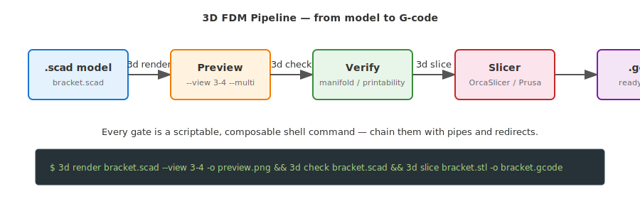
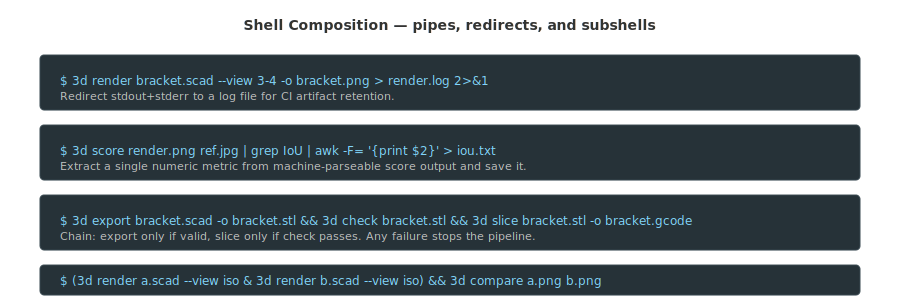
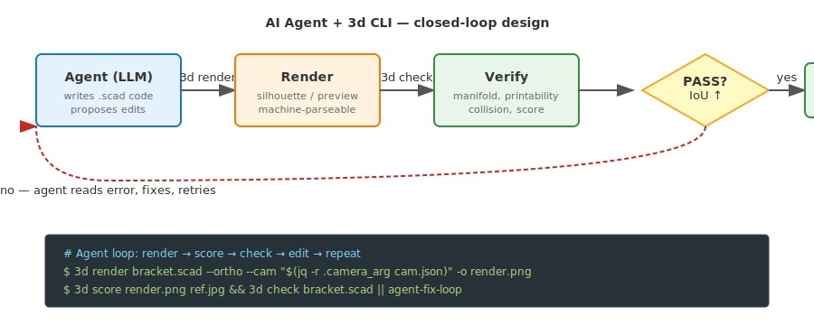

# `3d` — a scriptable, AI-assisted CLI + web toolkit for 3D FDM projects

`3d` is a command-line + web toolkit for the whole **[FDM](GLOSSARY.md#fdm) (filament 3D-printing)** lifecycle:
parametric modeling ([OpenSCAD](GLOSSARY.md#openscad)-first) → render & view → mesh / printability / collision
verification → AI-assisted design, animation, simulation, matching → slicing & print prep.
It is **engineering-first** today (functional parts, fits, gates) and grows toward art later.
Everything is one discoverable dispatcher: `3d <command>`, scriptable, composable, with
structured, actionable errors (what failed, why, and the exact fix).



It is **general-purpose** across 3D FDM work. One of the pipelines it ships is a
**reference-photo match loop** (camera-locked render → [silhouette](GLOSSARY.md#silhouette) score → LLM numeric-delta
edits → [manifold](GLOSSARY.md#manifold)/printability gates → accept-only-if-it-improves) — see
[Reference-match pipeline](#reference-match-pipeline) — one example workflow among many.

## What you can do with 3d

`3d` is a Swiss-army knife for the whole 3D FDM lifecycle — not a single-purpose tool. Major use cases:

- **Reference-photo match** — tune a parametric model to match a photo (one pipeline among many)
- **Design from scratch with AI** — text-to-3d, dimensions-and-sketch-to-3d, parametric skeleton generation (planned)
- **Parts & fixtures** — design brackets, mounts, connectors, enclosures with parametric constraints
- **Animation & motion** — kinematics, motion verification (planned)
- **Simulation & analysis** — FEA, strength, thermal, collision detection (planned)
- **Format conversion & AR** — export to USDZ/GLB/STEP, view in AR (partial: USDZ ready, GLB/STEP planned)
- **Slicing & print monitoring** — slice to G-code (ready), monitor prints, failure recovery (planned)
- **Batch & automated workflows** — multi-angle renders, batch exports, CI gates

The reference-photo match pipeline is [documented below](#reference-match-pipeline) as one example workflow.

## Real-life examples

### 1. Broken bracket — photo → model → print in 20 minutes

Your kid's stroller bracket snapped. You photograph the broken piece, write a rough
parametric `bracket.scad`, then let the CLI match it to the photo and verify it is printable.

```bash
# 1. Fit the camera to the photo so the render matches the viewpoint
3d fit-camera bracket.scad photo.jpg --out camera.json --draw-axes

# 2. Match loop: nudge parameters until silhouette matches the photo
3d match bracket.scad photo.jpg --rounds 10 --ortho --cam "$(jq -r .camera_arg camera.json)"

# 3. Verify the result is manifold and printable
3d check bracket.scad --mesh --printability

# 4. Export and slice
3d export bracket.scad -o bracket.stl
3d slice bracket.stl -o bracket.gcode
```

### 2. Router under-desk mount — measure → design → verify

You want a custom mount for a Wi-Fi router. You measure the hole spacing, write a
parametric model, then gate it before printing.

```bash
# 1. Scaffold a project
3d init router-mount --no-input

# 2. Edit router-mount/router-mount.scad with your dimensions
# 3. Render preview
3d render router-mount/router-mount.scad --view 3-4 -o preview.png

# 4. Check printability (wall thickness, overhangs, min features)
3d check router-mount/router-mount.scad --printability

# 5. If it passes, export and slice
3d export router-mount/router-mount.scad -o router-mount.stl
3d slice router-mount.stl -o router-mount.gcode
```

### 3. Reverse-engineer from a vintage mechanism photo

You have a photo of an old machine part and want a replica. The CLI finds the camera
pose, then an AI agent iteratively adjusts the model.

```bash
# 1. Preprocess the reference (subject mask + depth)
3d preprocess vintage.jpg -o work/

# 2. Fit camera to the masked reference
3d fit-camera replica.scad work/mask.png --out camera.json

# 3. Agent-driven match loop (dry-run to test the pipeline first)
3d match replica.scad work/mask.png --rounds 5 --dry-run --ortho --cam "$(jq -r .camera_arg camera.json)"

# 4. Run the real loop with an LLM critic
3d match replica.scad work/mask.png --rounds 15 --ortho --cam "$(jq -r .camera_arg camera.json)"
```

### 4. CI gate — every commit must be printable

Add a `3d check` step to your repository CI so no broken geometry ever reaches the printer.

```bash
# In your CI script (GitHub Actions, GitLab CI, etc.)
3d check models/*.scad --mesh --printability
```

A non-manifold model or a part with 0.4 mm walls on a 0.6 mm nozzle exits non-zero,
so the CI job fails and the PR is blocked.

### 5. Batch documentation renders

Generate a full set of views for a catalog or documentation page.

```bash
3d render bracket.scad --multi docs/assets/bracket/
```

This produces `bracket_front.png`, `bracket_back.png`, `bracket_left.png`, `bracket_right.png`, `bracket_top.png`, `bracket_iso.png`
concurrently — one command, six angles.

## Shell composition — pipes, redirects, and conditionals

Every `3d` command is a plain Unix tool: it reads files, writes files, prints text to stdout,
and exits with a meaningful code. This means you can compose them exactly like `grep`, `awk`,
or `make`.



### Redirect output to logs or files

```bash
# Save full render output (including possible OpenSCAD warnings) to a log
3d render bracket.scad --view 3-4 -o bracket.png > render.log 2>&1

# Extract just the IoU score from a machine-parseable score run
3d score bracket.png ref.jpg | grep IoU | awk -F= '{print $2}' > iou.txt
```

### Chain commands with `&&` and `||`

```bash
# Only export if the model is valid, only slice if export succeeded
3d check bracket.scad && 3d export bracket.scad -o bracket.stl && 3d slice bracket.stl -o bracket.gcode

# If check fails, open the preview to debug
3d check bracket.scad || (3d render bracket.scad --view 3-4 -o debug.png && open debug.png)
```

### Use `$(...)` subshells to wire outputs into inputs

```bash
# Render using the fitted camera from a previous step
3d render bracket.scad --ortho --cam "$(jq -r .camera_arg camera.json)" -o fit.png

# Run all gates and email the log if something breaks
3d check assembly.scad --collision verify/collision.json > check.log 2>&1 || mail -s "CHECK FAIL" me@example.com < check.log
```

### Parallel renders in a subshell

```bash
# Render two parts simultaneously, then compare them
3d render part-a.scad --view iso -o a.png & PID1=$!
3d render part-b.scad --view iso -o b.png & PID2=$!
wait $PID1 $PID2 && 3d compare a.png b.png
```

## Using 3d with AI agents

`3d` is designed to be driven by agents — not just humans. The output is machine-parseable,
errors are structured, and every command is idempotent and scriptable.



### Pattern 1: Agent writes `.scad`, CLI validates

An agent (LLM, Claude Code, Codex, etc.) writes or edits a `.scad` file. The CLI
immediately validates it:

```bash
# Agent writes a new model
# ...
# Agent runs the gate
3d check new_part.scad --mesh --printability
# If exit code != 0, agent reads the structured error, fixes the model, and retries.
```

### Pattern 2: Render → score → loop

The [match loop](#reference-match-pipeline) is the canonical agent-driven workflow:

```bash
# Agent proposes a parameter change
# 1. Render with current params
3d render model.scad --ortho --cam "$(jq -r .camera_arg camera.json)" -o render.png
# 2. Score against reference
3d score render.png ref.jpg
# 3. Check manifold / printability
3d check model.scad
# 4. Agent reads the score, decides the next edit, and repeats.
```

Because `3d score` prints `AE=...`, `IoU=...`, `CLOSENESS=...` as plain `KEY=VALUE` lines,
agents can parse them with a simple regex — no JSON schema needed.

### Pattern 3: CI agent — block bad geometry

```yaml
# .github/workflows/3d-gate.yml
- name: 3D geometry gate
  run: |
    3d check models/*.scad --mesh --printability
    3d lint --all
```

## Install

> **Honest status:** the package is **not on PyPI yet**. The supported, working path today
> is running it from a clone (`./bin/3d`). Standard `pipx`/`uv tool`/`pip` install is the
> TARGET once packaging lands (see [ROADMAP §29](ROADMAP.md)) — the `lib/` layout is being
> restructured into an importable `threed` package with a `3d` console-script entry point.

**Current working path — run from a clone:**

```bash
git clone https://github.com/alex-mextner/3d-cli
cd 3d-cli
./bin/3d help                 # or symlink bin/3d onto your PATH:  ln -s "$PWD/bin/3d" ~/.local/bin/3d
```

**Target path (after packaging, §29):**

```bash
pipx install 3d-cli           # or:  uv tool install 3d-cli   /   pip install 3d-cli
3d help
```

Python deps resolve per call: `3d` prefers a repo `.venv`, then `uv run --with <deps>` (no
global installs), then system `python3`. With `uv` on PATH nothing needs pre-installing. For
a fast offline path:

```bash
uv sync --all-extras          # creates .venv from the lockfile
```

## Requirements

`3d` **auto-installs what it can** on first run (OpenSCAD libraries clone into `libs/`; Python
deps resolve per call via `uv`/`.venv`), and every command either works or fails with a clear
"install X" message naming the exact per-OS command. Run **`3d doctor`** to inspect what is
present or missing.

**External tools** — system programs you install yourself (the CLI prints the exact per-OS line
when one is missing; `brew`/`apt`/`winget`):

| Tool | Purpose | Tier |
|---|---|---|
| [OpenSCAD](https://openscad.org) | the modeling engine — render, export, section, params, validate | **required** |
| [ImageMagick](https://imagemagick.org) | silhouette / overlay / score image diffs | required for the match pipeline |
| `python3` + [`uv`](https://docs.astral.sh/uv) | runtime for the python subcommands; `uv` resolves their deps per call (no global installs) | **required** (`uv` recommended) |
| a [slicer](GLOSSARY.md#slicer) — [OrcaSlicer](https://github.com/SoftFever/OrcaSlicer) / [Bambu Studio](https://bambulab.com/en/download/studio) / [PrusaSlicer](https://www.prusa3d.com/page/prusaslicer_424/) | G-code export & sliceability gate (`3d slice`) | optional |
| [ffmpeg](GLOSSARY.md#ffmpeg) | video export and animation pipelines | optional |
| [Blender](GLOSSARY.md#blender--bpy) | photoreal render (planned) — installed on demand, not bootstrapped | optional |

**Python packages** — resolved automatically by `uv`/`.venv`; you normally never install these by
hand. Only the heavyweight ones worth knowing about:

- **core (auto):** the mesh stack [`trimesh`](GLOSSARY.md#trimesh) + [`manifold3d`](GLOSSARY.md#manifold3d) (watertight / manifold / volume) and `pyyaml` (the `3d.yaml` project model).
- **optional extras:** `opencv` + `pillow` (`preprocess`), `pyvista` (`collision --viz`), `fastapi`/`uvicorn` (`web`). The full pinned set lives in `pyproject.toml` (`preprocess`/`viz`/`web`/`dev` extras) + `uv.lock`.

A missing optional dependency degrades only the command that needs it — never the whole CLI.
`3d doctor` prints PASS/MISSING per item with the exact per-OS install line for anything absent.

```bash
3d doctor          # read-only: report present/missing + the exact install command per OS
```

The CLI bootstraps OpenSCAD libraries ([BOSL2](GLOSSARY.md#bosl2), [NopSCADlib](GLOSSARY.md#nopscadlib)) into `libs/` on the first `3d`
invocation (once, quiet, non-fatal offline) and auto-exports `OPENSCADPATH`, so
`include <BOSL2/std.scad>` just resolves with no manual step.

## Commands

Run `3d <command> --help` for full options. Examples below assume `examples/cube.scad`.
For the full registered command map and per-command docs, see
[docs/commands/README.md](docs/commands/README.md).

### Render & view  (unified under `render`)

`render` is the one view/section command. `multi`/`section` remain as thin aliases.

| Command | What |
|---|---|
| `3d render <file.scad> [--view NAME]` | Single [CGAL](GLOSSARY.md#cgal) view. Camera computed from the model **bounding box** + the named direction. Default view: `iso`. |
| `3d render <file.scad> --multi [outdir] [--render]` | Render all standard angles (front/back/left/right/top/iso) concurrently. |
| `3d render <file.scad> --section -o out.png [--plane …] [--color]` | True cross-section: generic STL-cut (any geometry) or `--color` per-part assembly mode. |
| `3d render <file.scad> --cam ex,..,cz` | Manual 6-param **vector** camera (wins over `--view`). |
| `3d preview <file.scad>` | Fast throwntogether preview (no CGAL). |
| `3d multi …` / `3d section …` | back-compat aliases for `render --multi` / `render --section`. |

`--view` names: `front back left right top bottom iso 3-4 front-left front-right
rear-left rear-right`. `3-4` is the canonical three-quarter hero angle (azimuth 45°,
elevation 30°). With the trimesh mesh stack present the camera is placed exactly from the
model's bounding-box centroid + diagonal; without it, `render` orbits along the view
direction with `--autocenter --viewall` (so view selection always works, mesh stack or not).

```bash
3d render examples/cube.scad --view left -o left.png
3d render examples/cube.scad --view 3-4 --ortho
3d render examples/cube.scad --multi previews/ --render
3d render examples/cube.scad --section --plane YZ -o sec.png      # generic cut (any geometry)
3d render assembly.scad --section --color --plane YZ -o sec.png   # per-part coloured assembly
3d render examples/cube.scad --cam 130,-600,52,130,0,52 --ortho --size 1600x700
```

The match loop wants a **6-param [vector camera](GLOSSARY.md#vector-camera)** `ex,ey,ez,cx,cy,cz` (eye → center) plus
`--ortho`. The 7-param gimbal form (`...,dist`) with `dist=0` renders an empty frame —
`render`/`silhouette`/`score` reject a non-6 `--cam` value.

The generic `--section` exports the model to [STL](GLOSSARY.md#stl) once, then `difference(import(stl),
halfspace)` with the colour **outside** the cut so the cut face takes the part colour — it
cuts **arbitrary** geometry with no cut-contract needed. `--color` is the richer per-part
assembly mode (the assembly must honour `-D cut=true` and colour each part outside its own
`difference`). All section cameras are 6-param **vector** cameras, never a 7-param gimbal.

### Geometry & export

| Command | What |
|---|---|
| `3d export <file.scad>` | STL/[3MF](GLOSSARY.md#3mf) with manifold/self-intersect validation. **Nonzero exit on bad geometry.** |
| `3d validate <file.scad>` | Fast syntax check (no render). |
| `3d params <file.scad> [--json]` | Extract Customizer-style parameters. |
| `3d om <file.scad> <selector>` | Query `.scad` object-model annotations as JSON. |
| `3d usdz <file.scad\|file.stl>` | Export a colored USDZ for Apple AR Quick Look. |

```bash
3d export examples/cube.scad -o cube.stl          # PASS, exit 0
3d export examples/cube.scad -o cube.3mf -D 'width=80'
3d validate examples/cube.scad
3d params examples/cube.scad --json
3d om annotated.scad '#valve'
3d usdz examples/cube.scad -o cube.usdz
```

`export` validates the produced mesh with the trimesh/manifold3d stack (watertight +
manifold) when available — so a non-manifold part exits 1 even when OpenSCAD's modern
backend emits no text warning. Without the mesh stack it degrades to log-grep and tells
you to run `3d mesh` for the full check.

### QA & gates

`check` is the one verification command — the **master acceptance gate**. With no
selection flags it runs ALL applicable gates; selectors run a subset; `--skip` excludes.

| Command | What |
|---|---|
| `3d check <file.scad> [parts…]` | All applicable gates: manifold + consistency + printability (+ collision/silhouette when data is supplied). Prints a per-gate breakdown + `>>> CHECK: PASS/FAIL`. |
| `3d check … --mesh \| --manifold \| --consistency \| --printability` | run only the named **core** gate(s). |
| `3d check … --skip GATE` | exclude a gate (`manifold\|consistency\|printability\|collision\|silhouette`). |
| `3d check … --collision cfg.json` / `--ref img` | supply data; the collision/silhouette gate then runs (never narrows the core set). |
| `3d acceptance <assembly.scad>` | back-compat alias for `check` (all gates). |
| `3d mesh <file.stl\|3mf\|.scad>` | watertight / manifold / self-intersection / volume (trimesh + open3d/manifold3d; falls back to openscad warnings). |
| `3d printability <file.scad>` | wall / min-feature / overhang / orientation (FDM, PLA/PETG). |
| `3d collision <config.json>` | generic collision/penetration engine (static / `--frame` / `--viz`). |
| `3d lint [--all \| paths...]` | advisory repository lint rules. |

```bash
3d check examples/cube.scad                          # all applicable gates
3d check examples/cube.scad --mesh                   # only the manifold gate
3d check asm.scad --skip printability
3d check asm.scad --collision verify/collision.json --ref ref.jpg
3d mesh cube.stl
3d collision verify/collision.json --frame           # per-frame timeline gate
```

`--collision` and `--ref` supply **data**, not a selector: they make the collision /
silhouette gate applicable but never narrow the core gate set — so a supplied config can
**never** silently skip a HARD gate (no false PASS). For a genuine subset, use `--skip`
or name the core gates explicitly.

The collision engine is project-agnostic: a JSON config supplies the placement `.scad`,
part list, phases, intended-contact whitelist, and EPS/touch thresholds — all paths
resolved relative to the config file's directory.

### Reference-match pipeline

Match a parametric model to a reference photo by viewpoint and silhouette, for when you have a
photo of a real object and want a printable part with the same proportions and pose.

> You photograph a bracket, write a rough parametric `bracket.scad`, then `3d fit-camera` locks
the camera to the photo and `3d match` nudges the parameters until the rendered silhouette
matches the photo — keeping only edits that raise the silhouette [IoU](GLOSSARY.md#iou) and stay manifold.

| Command | What |
|---|---|
| `3d silhouette <file.scad>` | camera-locked render → binary silhouette mask. |
| `3d overlay <render.png> <reference.png>` | difference / 50% ghost / canny edge-overlay diagnostics. |
| `3d score <render.png\|file.scad> <reference>` | silhouette [AE](GLOSSARY.md#ae) + IoU (machine-parseable `KEY=VALUE` lines). |
| `3d match <assembly.scad> <reference>` | forced-monotonic acceptance loop (render→score→critic→apply→accept/revert + changelog). |
| `3d fit-camera <model.scad> <reference>` | fit an OpenSCAD camera to a reference photo by maximizing silhouette IoU; **saves the viewpoint** + a fit render + an overlay. |
| `3d preprocess <reference.jpg>` | subject mask + proportional depth ([SAM2](GLOSSARY.md#sam2)/[Depth-Anything V2](GLOSSARY.md#depth-anything-v2) if installable, else [OpenCV](GLOSSARY.md#opencv) fallback). |
| `3d compare <model.scad\|render.png> <reference.jpg>` | segmented model/reference comparison with IoU + SSIM/DSSIM and artifacts. |

```bash
3d silhouette examples/cube.scad -o mask.png --ortho --cam 130,-600,52,130,0,52
3d overlay render.png ref.jpg -o work/
3d score model.scad ref.jpg                       # renders, then scores
3d score mask_a.png mask_b.png --masks            # compare two ready masks
3d match model.scad ref.jpg --rounds 8 --dry-run  # exercise the loop without the LLM
3d fit-camera model.scad ref.jpg --out camera.json --draw-axes
3d preprocess ref.jpg -o work/ --force-fallback   # OpenCV grabCut + pseudo-depth
```

`fit-camera` searches the camera **pose** (azimuth, elevation, distance, pan-x, pan-z
orbiting the look-at) to maximize silhouette IoU between the CGAL render and the
reference, then writes `camera.json` with the fitted 6-param vector `camera_arg`, the
per-param values, the IoU, plus `<out>_fit.png` (full-res fit) and `<out>_overlay.png`
(render-cyan over reference-red ghost). The optimizer is random-search → coordinate-descent
with a deterministic seed. Crucially it is **scale-free**: it exports a temporary STL,
reads the model's bounding-box centroid + diagonal, and derives the distance/pan bounds and
refine steps from that diagonal — so a 20 mm cube and a 300 mm assembly both fit without
hardcoded numbers. `--center` overrides the auto look-at; `--draw-axes` overlays each
silhouette's PCA principal axis + bounding-box contour so axis/contour alignment is visible.
Different builds never reach IoU = 1 (the shapes differ) — the point is best alignment of
the bounding silhouette so viewpoint, scale and gross proportions match. Use the result:

```bash
openscad --render --camera="$(jq -r .camera_arg camera.json)" -o view.png model.scad
```

`score` prints `AE=`, `AE_NORM=`, `IoU=`, `CLOSENESS=`, `FRAME=`, `OVERLAY=` — one per
line, machine-parseable. An empty render mask scores IoU=0 (never rewards a blank frame).

`match` is the **[forced-monotonic loop](GLOSSARY.md#forced-monotonic-loop)**: the critic (codex, optional) proposes ONE numeric
param delta; the IoU/AE metric + manifold gate dispose. A change is kept iff the score
strictly improves AND the model stays a clean manifold; else it is reverted. Every step is
logged to `<work>/changelog.md`, which is fed back to the critic so it never re-proposes a
reverted edit (the anti-FlipFlop defense). Tunable parameters are **derived from the
constants file** (numeric scalars) — restrict with `--params a,b,c`, or point at a separate
`--constants FILE`. `--dry-run` skips the LLM and synthesises deterministic edits to
smoke-test the machinery.

### Slicing

| Command | What |
|---|---|
| `3d slice <stl\|3mf\|file.scad>` | slice to G-code via the installed slicer; **`--dry-run` = sliceability gate** (nonzero exit on failure). |
| `3d slice-check <3mf\|stl>` | **headless** verify a 3MF with no GUI: does it OPEN, how many PLATES, does it SLICE all plates? Exit 0 only if every check passes. |

```bash
3d slice part.stl -o part.gcode
3d slice part.scad --dry-run                          # .scad → STL → slice, gate only
3d slice part.3mf --profile "machine.json,process.json" --printer "Bambu Lab A1"

3d slice-check model.3mf                              # open + plate count + slice all plates
3d slice-check model.3mf --no-slice --plates 4        # open + assert 4 plates, no slicing
```

Slicer auto-detection preference: **OrcaSlicer → Bambu Studio → PrusaSlicer**. Found on PATH
and on macOS app bundles (`/Applications/OrcaSlicer.app/...`, `BambuStudio.app`,
`PrusaSlicer.app`); force a specific one with `SLICER=/path/to/binary`. The three share
heritage but the CLIs **diverged**, so each gets its own invocation: PrusaSlicer is `-g
--output out.gcode`, OrcaSlicer/Bambu are `--slice 0 --outputdir <dir>` (the produced G-code
is relocated to your `-o` path). Those core flags are the verified part of the contract;
`--printer` is **best-effort** (no single agreed printer-preset flag exists across the three
— it routes through the profile-load mechanism, so prefer `--profile` for control).
`--dry-run` slices as a pass/fail oracle and discards the G-code. `--check` is a deprecated alias. A `.scad` input is exported
to STL first via `3d export`. If no slicer is installed, `3d slice` fails with the exact
per-OS install command (e.g. `brew install --cask orcaslicer`) — never broken.

### Environment (deps) & tests

| Command | What |
|---|---|
| `3d init [path]` | scaffold a `3d.yaml` project skeleton. |
| `3d projects list\|add\|remove` | manage the project registry used by `3d web`. |
| `3d materials list\|show` | inspect FDM material names and properties. |
| `3d printers list\|show` | inspect printer names, bed volumes, and nozzle metadata. |
| `3d metrics list\|show` | inspect persisted command metrics JSONL records. |
| `3d doctor` | report present/missing deps + the exact install command per OS (read-only). |

```bash
3d init my-bracket --no-input
3d projects add ./my-bracket
3d materials list
3d printers list
3d doctor                 # PASS/MISSING table (read-only)
```

OpenSCAD libraries auto-install on the first run, python deps resolve via uv/`.venv`
per-call, and `3d doctor` prints the exact install command for anything still missing.

Repository development commands live in `rig.yaml` scripts:

```bash
dev run test              # ruff + pytest + mypy — all must pass
dev run test -- -k registry
```

#### Contributing — install the repo-dev pre-commit gate

A fresh clone has **no** dev pre-commit gate until you wire it in (git never tracks
`.git/hooks/`). The gate (ruff → pytest → mypy via `dev run test`) lives as a **tracked**
source at [`scripts/hooks/pre-commit`](scripts/hooks/pre-commit); install it once:

```bash
scripts/install-dev-hooks.sh        # copies the tracked hook into .git/hooks/pre-commit
```

It is idempotent (safe to re-run) and the installed hook blocks any commit whose
`dev run test` fails. The hook runs the **whole** gate (ruff + pytest + mypy over the
working tree, not just staged files), so commits take as long as `dev run test` does —
and, like any working-tree gate, it judges your working tree, not the exact staged
snapshot (an unstaged fix can green a commit; an unrelated unstaged break can block
one). It also fails **closed**: without the agent-tools `dev` runner on the PATH that
Git hooks receive, it blocks the commit rather than passing silently. Install/apply the
agent-tools dev CLI before installing this hook.

This repo-dev gate is **distinct from** the `3d init` user-facing pre-commit template
([`assets/templates/pre-commit`](assets/templates/pre-commit)): that one gates a *user's*
`.scad` project via `3d check` in the project `3d init` scaffolds, while this one gates
*this* repo's own Python source. They never collide — they live in different repos.

If your machine uses a global `core.hooksPath` composing dispatcher (e.g. agent-tools'
`~/.config/git/hooks`), that composer already runs the repo-local `.git/hooks/pre-commit`
as its first stage, so the tracked hook carries no dispatcher line of its own and needs no
extra wiring. If instead your existing hook calls a global-hooks dispatcher inline (the
case when a *local* `core.hooksPath` pointing at this repo's hooks dir bypasses the
composer), the installer **preserves that dispatcher prefix** and splices the dev gate in
below it, so your secret-scan and the dev gate both keep running. An existing, differing
hook is backed up to `.git/hooks/pre-commit.bak` first.

One sharp edge: if you set a *local* `core.hooksPath`, make it **absolute** (the
installer prints the exact `git config core.hooksPath …` line). A **relative**
`core.hooksPath = .git/hooks` works in the main checkout but is silently bypassed in a
linked worktree — `.git` is a *file* there, so the relative path resolves to nothing and
commits skip the gate. The installer warns when it sees a relative value. With no
`core.hooksPath` at all, git uses the common hooks dir by default and the gate just works
everywhere.

### Web dashboard

| Command | What |
|---|---|
| `3d web [--root DIR] [--port N] [--open]` | local FastAPI + SSE + three.js dashboard for your projects and for watching AI agents work live (optional **web** tier). |

```bash
3d web --root ~/models --open            # scan that root, open the dashboard
3d web --port 9000                       # override the default 8733
```

See [docs/commands/web.md](docs/commands/web.md) for the full feature list. The web tier
(`fastapi`/`uvicorn`/`markdown`) is optional — the core geometry/render/check pipeline does
not need it; a missing dep is a warning in `3d doctor`, not a failure.

### OpenSCAD libraries

BOSL2 + NopSCADlib **auto-install on the first `3d` invocation** (cloned into `libs/`, once,
gated by `~/.config/3d-cli/.bootstrapped`, non-fatal if offline), and `OPENSCADPATH` is
auto-exported by the CLI — so `include <BOSL2/std.scad>` just resolves, no manual step.

```bash
3d libs list                 # show installed libraries
3d libs path                 # print OPENSCADPATH (for your own non-3d shells)
# re-install: rm ~/.config/3d-cli/.bootstrapped && 3d help
```

## Configuration & state

`3d` keeps all its state under one config dir and one data dir (ROADMAP §23):

- **`~/.config/3d-cli/`** — `web.json`, the first-run bootstrap marker (`.bootstrapped`),
  the projects registry, and registry overrides. (Honors `$XDG_CONFIG_HOME`.)
- **`~/.local/share/3d-cli/`** — generated state, including the longitudinal metrics store.
  (Honors `$XDG_DATA_HOME`.)

## Layout

```
bin/3d              thin Python dispatcher (resolves REPO_ROOT through the symlink)
lib/cli/dispatch.py routing + registry build + structured-error rendering
lib/cli/registry.py the command registry (Command + discover()) — the plugin extension point
lib/cli/env.py      tool discovery, OS/install table, OPENSCADPATH export, first-run bootstrap
lib/cli/paths.py    the single source of truth for config/data dirs (~/.config/3d-cli, …)
lib/cli/pyrun.py    run a lib/*.py tool with its deps (.venv -> uv -> system python3)
lib/cli/imaging.py  ImageMagick orchestration + the pure score (IoU/AE) math
lib/project.py      the 3d.yaml project model + loader (the project spine, §5/§15)
lib/errors.py       structured CLI error types (WHAT/WHY/remediation/accepted/install)
lib/commands/*.py   one self-registering module per subcommand (drop a file = add a command)
lib/*.py            heavy python tools (render/mesh/collision/printability/preprocess/match/fit)
lib/web/            the web dashboard app (FastAPI + SSE + three.js SPA)
tests/              ruff + pytest unit tests + the CLI smoke harness + mypy gate (`dev run test`)
docs/commands/      per-command documentation fragments
docs/critic-prompts.md  the vision-critic prompt patterns
libs/               OpenSCAD libraries cloned on demand (gitignored)
examples/cube.scad  trivial test part
pyproject.toml      python deps (uv project: core + optional extras preprocess/viz/web/dev)
uv.lock             locked dependency set (uv sync)
```

Adding a command is a one-file change — see `lib/cli/registry.py` (and `AGENTS.md`) for the
command-authoring contract. `bin/3d` and the shared files need no edits.

## How a coding agent + 3d compares

`3d` is a tool **for an agent**, not a standalone CLI you grade on its own. The right unit
of comparison is the combo **Claude Code (or any coding agent) + `3d`** — the agent supplies
the intelligence (it generates the model, reads the score, decides the next edit) and `3d`
supplies the deterministic 3D operations (render, silhouette-IoU score, manifold/printability
gates, slice). Judging `3d` *alone* — "the CLI has no neural mesh generator, so text→3D is a
dash" — measures the wrong thing. The agent is the generator; `3d` is its hands.

So the comparison is **agent + `3d`** against the wave of **AI 3D-generation services** —
hosted text-to-3D and image-to-3D platforms like **[Meshy](https://www.meshy.ai)**,
**[Tripo](https://www.tripo3d.ai)**, **[Rodin / Hyper3D](https://hyper3d.ai)**,
**[Kaedim](https://www.kaedim3d.com)**, and **[Sloyd](https://www.sloyd.ai)**. They take a
prompt or a photo and return a textured mesh in seconds, in a browser, billed by credits, and
mostly stop there. The combo takes a prompt or a photo and drives it all the way to a
**printable physical part**, locally and scriptably.

The pitch in one line: **an agent + `3d` can take text or an image → a real, editable,
printable model end-to-end** — a *parametric / CAD* route to 3D (not neural mesh-gen), driven
by an agent loop the SaaS don't have. From a text prompt the agent writes a parametric
[OpenSCAD](GLOSSARY.md#openscad) model (`3d ai` assembles the context bundle it reasons over);
from a reference photo the agent + `3d fit-camera`/`match`/`score` iterate that model toward
the photo's silhouette under a forced-monotonic [IoU](GLOSSARY.md#iou) + [manifold](GLOSSARY.md#manifold)
gate. The output is a source model you can diff in git, gate for FDM, and slice — no upload,
no credits.

| Capability | **agent + 3d** | Meshy | Tripo | Rodin (Hyper3D) | Kaedim | Sloyd |
|---|---|---|---|---|---|---|
| Text → 3D | ✓ (agent writes a parametric OpenSCAD model; `3d ai` bundles the context) | ✓ | ✓ | ✓ | — | ✓ |
| Image → 3D | ~→✓ (agent + `fit-camera`/`match`/`score` silhouette-IoU loop toward the photo) | ✓ | ✓ | ✓ | ✓ | ✓ |
| Route to 3D | parametric / CAD (editable, mechanical) | neural mesh | neural mesh | neural mesh | neural mesh | parametric templates |
| Parametric / source-editable model | ✓ (OpenSCAD, git-diffable) | — | — | — | — | ~ (hosted slider templates) |
| Mesh repair & manifold check | ✓ | ~ (analyze/repair API) | ~ (remesh/clean topo) | ~ (clean surfaces) | ~ (human-in-loop) | — |
| FDM printability gates (wall / overhang / orientation) | ✓ | ~ (printability *analysis* only) | — | — | — | — |
| Slice → G-code | ✓ (delegates to installed slicer) | — (exports 3MF, no slice) | — | — | — | — |
| Print prep / job planning | ~ (dry-run job plan; monitoring planned) | — | — | — | — | — |
| AR / USDZ export | ✓ (`3d usdz`) | ✓ (USDZ export) | ~ | — | — | — |
| Agent-native loop (generate → score → decide → repeat) | ✓ | — | — | — | — | — |
| Local / no hosted service / no credits | ✓ | — | — | — | — | — |
| Scriptable CLI / no web app | ✓ | — (REST API) | — (REST API) | — (REST API) | — (REST API) | — (REST API) |

`✓` = yes, `~` = partial, `—` = no.

**Where the SaaS genuinely win — said plainly:** for **organic, concept, character and
one-shot** geometry — "a chunky robot", a creature, a single photo of an irregular sculpt —
Meshy, Tripo, Rodin, Kaedim and Sloyd return a finished, textured, riggable mesh in seconds
with **one click and zero local setup**. The parametric route is **not** equivalent there: an
agent writing OpenSCAD is strong on *mechanical / matchable* shapes (brackets, mounts,
enclosures, parts with measurable proportions) and weak on free-form organic surfaces, and it
costs reasoning rounds the SaaS skip. For concept art, game/film assets and arbitrary
photo→organic-mesh, the neural services are simply the right tool and the combo is not
pretending to beat them.

**Where the agent + `3d` is honestly stronger:** the **printable-part endgame** and the
**agent loop**. The SaaS hand you a mesh and stop — usually a hosted, credit-gated, often
non-printable one. Meshy is the closest: it has *Analyze Printability* / *Repair Printability*
APIs, a multi-color 3MF export, and even links out to Bambu Studio / OrcaSlicer — but it still
**stops at a 3MF**; it does not run FDM wall/overhang/orientation gates or the slice itself
(mark `~`). The others stop at the mesh entirely. The combo runs the manifold + FDM
printability gates, performs (delegates) the slice, emits a job plan, exports USDZ for AR, and
does it all as a **local, pipeable, exit-code-gated CLI an agent drives in a loop** — with no
upload, no credit meter, and a parametric source model you can diff in git. The two ends are
complementary: **generate organic meshes with a SaaS when you need them, but for a
text-or-photo → printable mechanical part, an agent + `3d` does the whole pipeline itself.**

## Ecosystem

Part of the [HyperIDE.ai](https://hyperide.ai) agent toolchain:

- **[tg-cli](https://github.com/alex-mextner/tg-cli)** — simple Telegram CLI to send messages, photos & files, and a two-way agent bridge (reports, Q→buttons, voice/rich)
- **[review-cli](https://github.com/alex-mextner/review-cli)** — agentic, priority-ordered failover multi-model code-review board (brainstorm/quorum, spec-web, dashboard)
- **[rig-cli](https://github.com/alex-mextner/rig-cli)** — umbrella dev-env driver: sets up a repo from config — skills, hooks, CI, dep-bootstrap; reconciles drift
- **[agent-tools](https://github.com/alex-mextner/agent-tools)** — the shared catalog `rig` applies: portable agent skills, agent-hooks, the global git-hook dispatcher, CI gates, and MCP servers
- **[draw-cli](https://github.com/alex-mextner/draw-cli)** — text-to-image via Hugging Face
- **[hyperide.ai](https://hyperide.ai)** — Figma replacement inside VS Code. Edit React components directly through AST/LSP without AI hallucinations, token waste, or context-window limits. Works for indie vibe-coding and for enterprise teams with split design/dev roles.

Each CLI registers a skill into your agent harnesses (`<tool> install-skill`) so agents know it exists — see Install.
